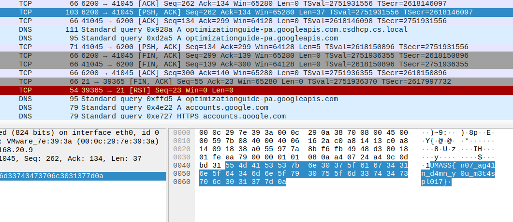

## Writeup for No Updates

Given to us is a pcap file containing the flag in the TCP packets.

flag: `UMASS{n07_ag41n_d4mn_y0u_m3t4spl017}`

### Solution

Filter packets by TCP and then search for the flag, i.e., "UMASS"

